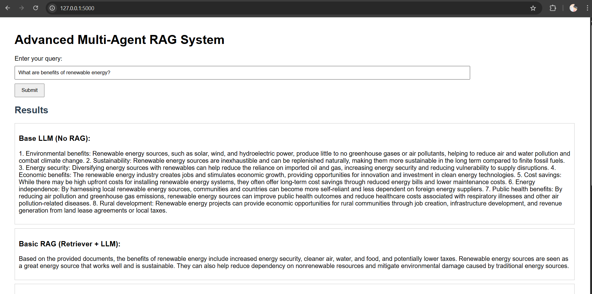

[](https://classroom.github.com/a/QnV1lZz2)


# Advanced Multi-Agent RAG System: Final Project

This repository is the final integrated project that stitches together the work from:
- **Assignment 1 (Parts 1 & 2):** Data processing, chunking, embedding, and Pinecone vector database retrieval.
- **Assignment 3:** Fine-tuning a T5 model using LoRA for summarization.
- **Assignment 4:** Building an advanced agentic RAG workflow using LangGraph.

The system implements an advanced Retrieval-Augmented Generation (RAG) workflow that uses multiple LLM-based agents. At least one of these agents uses a LoRA fine-tuned T5 model. 
**My project runs within 5 min, therefore according to TA Tom, I don't need a Unit Test**.
The system supports four approaches:
1. **Base LLM:** Directly querying ChatOpenAI (no retrieval).
2. **Basic RAG:** Retriever + ChatOpenAI answer generation.
3. **Agentic RAG (Base Summarization):** Uses ChatOpenAI summarization in a multi-agent system.
4. **Agentic RAG (Fine-Tuned Summarization):** Uses the LoRA fine-tuned T5 model for summarization in a multi-agent system.

A web application (using Flask) provides a real chat-like interface where users enter a query and receive four answers generated by these different workflows.

---

## Directory Structure

```
.
├── Dockerfile                      # Dockerfile to build the Docker image
├── t5_lora_summarization           # Saved Fine-tuned t5 model from assignment 3
├── final.py                        # Integrated CLI version of the final assignment
├── final_web.py                    # Integrated web app version of the final assignment
├── outputs_5questions.txt          # Document with sample outputs
└── README.md                       # This README file
```

---

## Setup and Installation

### Prerequisites
- Python 3.9+
- Docker (for containerizing the project)
- Required API keys (Pinecone and OpenAI). **Important:** Update the absolute path for your fine-tuned T5 model (`FINETUNED_MODEL_PATH`) in the code.

### Installing Dependencies
Clone the repository from GitHub Classroom:
```bash
git clone <repository-url>
cd <repository-directory>
```
Install the required packages:
```bash
pip install pinecone-client langchain-huggingface langchain-pinecone langchain-openai langgraph transformers torch flask
```

---

## Running the Application
Before running everything, remember to change API Key of Pinecone and OpenAI.

### 1. Command-Line Interface (CLI)
To run the integrated multi-agent RAG system via the CLI, execute:
```bash
python final.py
```
You will be prompted to enter a query. The system will automatically generate four answers using:
- **Base LLM (No RAG)**
- **Basic RAG (Retriever + LLM)**
- **Agentic RAG with Base Summarization**
- **Agentic RAG with Fine-Tuned Summarization**

Alternatively, I prepared a 5 questions set to test the output, the questions include:
- **"What are the benefits of renewable energy?"**
- **"How does climate change impact agriculture?"**
- **"Explain the significance of artificial intelligence in modern society."**
- **"What are the key challenges in cybersecurity?"**
- **"How can urban planning improve quality of life?"**

To run the testing questions and results:
```bash
python final.py eval
```

### 2. Web Application
Also designed a web interface besides the command line interface.
To run the web-based chat interface:
```bash
python final_web.py
```
Then, open your browser and navigate to `http://localhost:5000`. Enter your query in the provided form to see four answers displayed in a chat-like format.
You will get something like:



### 3. Running Different Tests
To run the tests on sample queries, execute:
```bash
python final.py eval
```
The results are printed to the console and saved in `outputs_5questions.txt`.

---

## Docker Instructions

### Building the Docker Image
From the project directory, run:
```bash
docker build -t stitch-rag .
```
This builds a Docker image tagged as `stitch-rag`.

### Running the Docker Container
To run the container interactively:
```bash
docker run -it --rm stitch-rag
```
To run the web application in Docker, modify the `CMD` in the Dockerfile to run `final_web.py` if needed.


---

## Sample Outputs and Discussion

### Sample Outputs

Below are sample outputs for a few queries (saved in `outputs_5questions.txt`, if you wish to see full outputs, I pasted at the end of this README):

**Query: What are the benefits of renewable energy?**

- **Base LLM:**  
  *Provides a detailed and structured answer outlining environmental protection, energy independence, economic growth, and more.*

- **Basic RAG:**  
  *Generates a concise answer based on retrieved documents, but may be less detailed.*

- **Agentic RAG (Base Summarization):**  
  *Delivers a coherent, unified answer by summarizing retrieved content via ChatOpenAI.*

- **Agentic RAG (Fine-Tuned Summarization):**  
  *Produces the highest quality answer, leveraging the LoRA fine-tuned T5 model for nuanced summarization.*

**Query: How does climate change impact agriculture?**

- **Base LLM:**  
  *Details effects such as temperature rise, changes in precipitation, and extreme weather events.*

- **Basic RAG:**  
  *Offers a more concise version based on document retrieval.*

- **Agentic RAG (Base Summarization):**  
  *Integrates retrieved context into a unified summary and answer.*

- **Agentic RAG (Fine-Tuned Summarization):**  
  *Delivers an answer that is both comprehensive and context-aware due to the specialized fine-tuning.*

### Discussion on Outputs

- **Base LLM:**  
  Provides detailed responses based on inherent model knowledge, but they may be generic and lack contextual grounding.

- **Basic RAG:**  
  By incorporating retrieved documents, the response becomes more contextually relevant; however, integration is limited without further processing.

- **Agentic RAG (Base Summarization):**  
  Using a summarization agent with ChatOpenAI improves coherence by fusing multiple document snippets into a unified summary before answering.

- **Agentic RAG (Fine-Tuned Summarization):**  
  The most refined approach; the LoRA fine-tuned T5 model extracts nuanced information from the retrieved documents, resulting in answers that are accurate, well-organized, and contextually enriched.

As you progress from the Base LLM to the advanced RAG with a fine-tuned agent, you observe improved contextual integration, clarity, and specificity in the answers.

---
Below is a discussion on the qualitative differences among the four workflows, based on the provided output examples:

### Qualitative Discussion on Response Quality

**1. Base LLM (No RAG):**

- **Detail and Structure:**  
  The Base LLM response is detailed and well-structured. It presents several enumerated points that clearly outline benefits or impacts. For example, in the renewable energy query, it lists multiple advantages with clear headings (e.g., environmental protection, energy independence).

- **Generic and Knowledge-Driven:**  
  However, while detailed, the response reflects the generic knowledge embedded in the LLM. It may not be tailored to the specific nuances of the query context since it does not leverage external documents or specialized context.

**2. Basic RAG (Retriever + LLM):**

- **Conciseness:**  
  The Basic RAG response tends to be more concise. It retrieves documents based on the query, then generates an answer by combining those retrieved pieces. In the example, it provides a brief summary that captures a few key aspects (e.g., sustainability and clean air).

- **Limited Integration:**  
  Since the Basic RAG system only appends retrieved documents to the prompt without additional processing, the answer might miss some depth or integration compared to the base LLM. It may also vary in quality depending on the relevance of retrieved documents.

**3. Agentic RAG (Base Summarization):**

- **Improved Coherence:**  
  With the agentic workflow that uses ChatOpenAI for summarization, the response is more integrated and coherent. The summarization node helps to condense the retrieved documents into a focused summary before generating the final answer. This leads to a response that is generally more aligned with the core aspects of the query.

- **Context-Aware Integration:**  
  The summarization here benefits from the LLM’s ability to merge multiple pieces of information into a unified answer, which typically results in a response that is both concise and contextually rich. For instance, the answer regarding renewable energy combines environmental, economic, and social aspects in a unified narrative.

**4. Agentic RAG (Fine-Tuned Summarization):**

- **Enhanced Specificity and Nuance:**  
  The Advanced Agentic RAG with Fine-Tuned Summarization produces the most refined and detailed responses. By incorporating a LoRA fine-tuned T5 model for summarization, the system leverages specialized training to extract key information from the retrieved documents. This often results in a summary that captures multiple nuanced benefits or challenges.

- **Higher Quality Output:**  
  In the renewable energy example, the fine-tuned model generates an answer that is not only detailed but also well-organized, enumerating several key points (e.g., environmental impact, energy independence, job creation, cost savings, sustainability). The response exhibits a clearer focus and provides a more balanced view compared to the base summarization.

- **Contextual Accuracy:**  
  Additionally, the fine-tuned summarization tends to be more accurate in reflecting the specific context of the query. For instance, it differentiates between environmental, economic, and resource-based benefits more effectively, which can lead to a higher-quality, trustworthy answer.

---

### Overall

- **Transition from Base LLM to Advanced Agentic RAG:**  
  As you move from the Base LLM to the advanced RAG systems, there is a clear trend in quality improvement:
  - **Base LLM:** Offers detailed, structured answers but might be generic.
  - **Basic RAG:** Introduces retrieved context, though the integration is somewhat superficial.
  - **Agentic RAG with Base Summarization:** Provides better integration and coherence by summarizing retrieved data before generating the answer.
  - **Agentic RAG with Fine-Tuned Summarization:** Delivers the most refined responses by leveraging a specialized fine-tuned model to extract nuanced insights, resulting in answers that are comprehensive, accurate, and tailored to the query.


---
Outputs from the five questions:

Query: What are the benefits of renewable energy?
Base LLM:
1. Environmental protection: Renewable energy sources produce lower levels of greenhouse gas emissions compared to fossil fuels. This helps to combat climate change and reduce air pollution.

2. Energy independence: Using renewable energy sources can help reduce the dependence on imported energy resources, promoting energy security and stability.

3. Economic growth: Investing in renewable energy technologies can create new jobs and boost the economy. It also provides opportunities for innovation and technological advancements.

4. Cost-effective: Renewable energy sources have low operating costs and can help reduce overall energy bills in the long term. Additionally, the costs of renewable energy technologies are steadily decreasing as they become more widespread.

5. Sustainable energy supply: Renewable energy sources are abundant and can be continuously replenished, unlike finite fossil fuels. This ensures a more reliable and sustainable energy supply for the future.

6. Improved public health: By reducing air and water pollution, renewable energy sources help improve public health and reduce the incidence of respiratory illnesses and other health problems associated with fossil fuel use.

7. Diversification of energy sources: Relying on multiple sources of renewable energy helps diversify the energy mix, reducing the risk of supply disruptions and price volatility associated with fossil fuel dependence.

8. Community benefits: Renewable energy projects can bring positive impacts to local communities, such as increased tax revenue, job opportunities, and infrastructure development.

Basic RAG:
The benefits of renewable energy include being a great energy source, sustainability, not necessary as a replacement for all energy needs, and helping to ensure clean air, water, and food. Renewable energy can contribute to energy security and environmental preservation.

Agentic RAG (Base Summarization):
Renewable energy offers numerous benefits such as mitigating climate change, reducing greenhouse gas emissions, improving air quality, creating jobs in clean energy industries, and enhancing energy security by diversifying energy sources. While renewable energy may not fully meet all energy security needs, it plays a crucial role in moving towards a sustainable future. It is important to consider various factors such as taxes and environmental protection when designing energy systems to maximize the benefits of renewable energy and promote a clean and efficient energy transition.

Agentic RAG (Fine-Tuned Summarization):
Renewable energy sources offer numerous benefits compared to traditional fossil fuels. Some of the key advantages include:
1. Environmental Impact: Renewable energy sources, such as solar, wind, and hydropower, produce significantly lower greenhouse gas emissions and air pollutants compared to fossil fuels, helping combat climate change and improve air quality.
2. Energy Independence: By relying on renewable sources, countries can reduce their dependence on imported fuels and increase energy security.        
3. Job Creation: The renewable energy sector has shown significant potential for job creation, providing economic opportunities and supporting local communities.
4. Cost Savings: As technology advances and economies of scale are achieved, the cost of renewable energy production continues to decrease, making it a more cost-effective option in the long run.
5. Resource Sustainability: Unlike finite fossil fuel reserves, renewable energy sources are inexhaustible and readily available, ensuring a more sustainable energy future for generations to come.

By transitioning to renewable energy sources, societies can create a more resilient, sustainable energy system that supports economic growth, environmental protection, and public health.


Query: How does climate change impact agriculture?
Base LLM:
Climate change has a significant impact on agriculture in a variety of ways:

1. Changes in temperature: Rising temperatures can affect the growth and development of crops, leading to reduced yields or crop failures. Some crops may also thrive in warmer conditions, leading to changes in what can be successfully grown in certain regions.

2. Changes in precipitation patterns: Climate change can also alter precipitation patterns, leading to droughts or heavy rainfall in certain areas. This can impact water availability for irrigation, as well as increase the risk of flooding and soil erosion.

3. Increased occurrence of extreme weather events: Climate change is expected to increase the frequency and intensity of extreme weather events such as hurricanes, heatwaves, and wildfires. These events can cause significant damage to crops and infrastructure, leading to financial losses for farmers.

4. Changes in pest and disease patterns: Warmer temperatures and changing climate conditions can also impact the distribution and abundance of pests and diseases that affect crops. This can lead to increased pest pressure and the need for additional pest management practices.

5. Soil degradation: Climate change can also exacerbate issues related to soil degradation, such as erosion, salinization, and nutrient depletion. These factors can reduce soil fertility and productivity, making it more difficult for farmers to grow crops successfully.

Overall, climate change poses significant challenges for agriculture by altering growing conditions, increasing the risk of crop losses, and necessitating changes in farming practices to adapt to changing climate conditions.

Basic RAG:
Climate change impacts agriculture in various ways. It can lead to changes in precipitation patterns, temperature extremes, and increased pest and disease pressure on crops. This can result in crop failures, reduced yields, and increased pressure on farmers to adapt to changing conditions. Additionally, climate change can also result in food insecurity, as certain crops become less viable in certain regions. Furthermore, the impact of climate change on agriculture can also be compounded by other environmental factors, such as the loss of biodiversity and the use of highly processed foods, which can impact fertility rates and the overall health of the population. Ultimately, addressing climate change and its impacts on agriculture requires a multi-faceted approach that includes both policy intervention and individual action.

Agentic RAG (Base Summarization):
Climate change can greatly impact agriculture in various ways. Rising temperatures, changing weather patterns, and more extreme weather events can lead to reduced crop yields, increased pests and diseases, and water scarcity. Supporting small farms, breaking up big agricultural companies, and promoting environmental justice through diverse crops can help mitigate these effects. Additionally, false narratives around climate change and potential weaponization of food, like vaccinating cattle to reduce carbon emissions, are concerns. Fertility issues related to highly processed foods and the impact of a weakening magnetic field on climate change are also factors to consider in understanding the complex relationship between climate change and agriculture.

Agentic RAG (Fine-Tuned Summarization):
Climate change has a significant impact on agriculture in various ways. Rising temperatures, extreme weather events, and changes in precipitation patterns can reduce crop yields, decrease crop quality, and increase the prevalence of pests and diseases. These factors can lead to food insecurity, crop failure, and economic losses for farmers. Governments play a crucial role in implementing policies and initiatives to help farmers adapt to and mitigate the effects of climate change on agriculture. By investing in sustainable farming practices, research and development, and providing support to farmers, governments can help build resilience in the agricultural sector and ensure food security for future generations.


Query: Explain the significance of artificial intelligence in modern society.
Base LLM:
Artificial intelligence (AI) plays a crucial role in modern society across various industries and sectors. Its significance lies in its ability to perform tasks that typically require human intelligence, such as learning, problem-solving, decision-making, and language understanding. Some key ways in which AI is impactful in modern society include:

1. Automation: AI enables automation of repetitive tasks, increasing efficiency and productivity in various industries. This not only saves time but also reduces human error and costs.

2. Personalization: AI algorithms analyze huge amounts of data to provide personalized recommendations, services, and experiences to individual users. This personalization enhances customer satisfaction and drives business growth.

3. Healthcare: AI is transforming healthcare by enabling faster and more accurate diagnosis, personalized treatment plans, and prediction of potential health issues. This leads to improved patient outcomes and increased efficiency in healthcare delivery.

4. Finance: AI is widely used in the finance industry for fraud detection, risk assessment, algorithmic trading, and customer service. These AI applications help improve decision-making, reduce financial risks, and enhance customer experience.

5. Marketing and Advertising: AI-powered tools are used to analyze customer behavior, predict trends, and optimize marketing campaigns. This enables businesses to target the right audience with relevant content, resulting in increased engagement and higher ROI.

6. Transportation: AI is driving innovations in autonomous vehicles, traffic management systems, and logistics optimization. These advances are making transportation safer, more efficient, and environmentally friendly.

7. Education: AI technologies are being used to personalize learning experiences, provide feedback to students, and assist teachers in creating tailored educational content. This enhances the effectiveness of education and enables lifelong learning.

Overall, artificial intelligence is significantly shaping modern society by revolutionizing the way we work, communicate, and live. Its continued development and integration into various aspects of our lives hold the potential to drive innovation, improve efficiency, and create new opportunities for growth and progress.

Basic RAG:
Artificial intelligence plays a significant role in modern society as it enhances efficiency, productivity, and decision-making across various industries. The current AI systems may be considered as a "Superhuman System 1", capable of processing vast amounts of data and information at speeds beyond human capability. However, it is important to note that AI is ultimately controlled and directed by the policies set by the companies that own them, raising questions about transparency, accountability, and ethics.

The progression of AI and technology has evolved over the years, with the emergence of "powerful AI mathematicians" replacing the need for "powerful computer mathematicians". This continuous evolution in the ecosystem demonstrates our ongoing efforts to improve and innovate in similar ways, albeit with more advanced tools and systems.

Experts like Marietje Schaake emphasize the importance of understanding that the way we perceive and interact with technology is greatly influenced by the tech companies that develop and control these AI systems. This highlights the need for critical thinking, regulation, and ethical considerations in the implementation and use of AI in society.

Additionally, the prospect of "real AI" in the future, such as simulating scanned human brains, holds promise for further advancements and breakthroughs in the field of artificial intelligence. This suggests that AI will continue to shape and impact various aspects of modern society in the coming years.

Agentic RAG (Base Summarization):
Artificial intelligence plays a significant role in modern society by revolutionizing various industries such as healthcare, finance, transportation, and more. It has the potential to automate tasks, analyze large amounts of data, improve decision-making processes, and enhance overall efficiency. However, current AI technology has limitations that are influenced by the policies of tech companies. There is also a distinction between powerful AI mathematicians, which can perform specific tasks efficiently, and powerful computer mathematicians, which excel at broader problem-solving. In the future, the development of "real AI" through simulating scanned human brains could lead to advancements that may further shape society.

Agentic RAG (Fine-Tuned Summarization):
Artificial intelligence holds significant importance in modern society due to its ability to streamline processes, improve efficiency, and make data-driven decisions. AI technology is being integrated into various industries such as healthcare, finance, transportation, and more, revolutionizing how tasks are performed. It enables predictive analytics, personalized recommendations, and automation of repetitive tasks. However, it is crucial to consider ethical implications and ensure transparency and accountability in the development and deployment of AI systems to prevent bias and ensure human oversight.


Query: What are the key challenges in cybersecurity?
Base LLM:
1. Data breaches: Hackers are constantly attempting to breach systems and steal confidential information, such as customer data, financial records, and intellectual property.

2. Ransomware attacks: Cybercriminals use ransomware to encrypt data and demand a ransom in exchange for the decryption key, causing major disruptions to businesses and organizations.

3. Phishing attacks: Phishing emails and scams trick users into providing sensitive information or downloading malicious software, putting systems at risk.

4. Insider threats: Employees, contractors, or partners with access to sensitive data may intentionally or unintentionally compromise cybersecurity defenses.

5. Lack of cybersecurity awareness: Many individuals, organizations, and employees lack basic knowledge of cybersecurity best practices, making them more vulnerable to cyber attacks.

6. Security vulnerabilities in software and hardware: Outdated software, unpatched systems, and insecure configurations can create opportunities for cyber attackers to exploit weaknesses.

7. Compliance and regulatory requirements: Organizations must comply with industry regulations and data protection laws, such as GDPR and HIPAA, which can be complex and costly to implement.

8. Lack of skilled cybersecurity professionals: The cybersecurity industry faces a shortage of qualified professionals, making it difficult for organizations to find and retain skilled talent to protect their systems.

9. Increasing complexity of IT environments: With the rise of cloud computing, Internet of Things (IoT) devices, and mobile technology, organizations struggle to secure interconnected systems and devices.

10. Advanced persistent threats (APTs): Sophisticated cyber attacks carried out by well-funded and highly skilled hackers pose a significant challenge for cybersecurity professionals, as they require advanced detection and response capabilities.

Basic RAG:
Based on the provided documents, the key challenges in cybersecurity include protecting businesses from cyber threats, ensuring the secure running of IT projects, and catching oddball keywords that may signify potential security risks. Other challenges in cybersecurity may include staying up to date with evolving cyber threats, implementing best practices for data protection, and securing systems against cyber attacks.

Agentic RAG (Base Summarization):
Key challenges in cybersecurity include:

1. Cyber threats: Constantly evolving cyber threats such as malware, ransomware, phishing attacks, and insider threats pose a significant risk to organizations.

2. Data breaches: Data breaches can result in financial losses, reputational damage, and legal consequences for businesses. Protecting sensitive data is crucial.

3. Lack of skilled professionals: The cybersecurity field faces a shortage of qualified professionals, making it challenging for organizations to find and retain talented individuals.

4. Compliance and regulations: Compliance with various laws and regulations, such as GDPR and HIPAA, adds complexity to cybersecurity efforts and requires organizations to stay up to date with changing requirements.

5. Budget constraints: Adequate investment in cybersecurity tools and technologies is essential, but many organizations face budget constraints that limit their ability to implement robust security measures.

Attending events like the Business Workshop at The CATALYST can provide valuable insights and best practices for addressing these challenges and protecting your business from cyber threats.

Agentic RAG (Fine-Tuned Summarization):
Key challenges in cybersecurity include:

1. Data breaches: Hackers continuously try to gain unauthorized access to sensitive data, causing breaches that can result in significant financial and reputational damage to organizations.

2. Evolving threats: Cyber threats are constantly evolving, with attackers using sophisticated techniques to exploit vulnerabilities in systems and networks.

3. Insider threats: Employees or third parties with access to sensitive data can inadvertently or maliciously cause security breaches.

4. Compliance requirements: Organizations must comply with various regulations and standards related to data protection, such as GDPR, HIPAA, or PCI DSS, which can be challenging to navigate and implement effectively.

5. Lack of cybersecurity skills: There is a shortage of skilled cybersecurity professionals, making it difficult for organizations to effectively defend against cyber threats.

Attending the cybersecurity workshop mentioned in your query could provide valuable insights and strategies for protecting your business from these challenges.


Query: How can urban planning improve quality of life?
Base LLM:
1. Designing walkable and bikeable communities: Urban planning can create infrastructure and spaces that encourage walking and cycling, which can improve physical health and reduce traffic congestion.

2. Providing access to green spaces: Urban planning can incorporate parks, gardens, and other green spaces into cities to improve air quality, provide opportunities for recreation, and reduce stress.

3. Promoting mixed-use development: Urban planning can encourage the creation of neighborhoods that include a mix of residential, commercial, and recreational spaces, which can reduce the need for long commutes and increase social interactions.

4. Enhancing public transportation: Urban planning can prioritize public transportation options such as buses, trains, and bike-sharing programs to improve access to jobs, education, and healthcare for all residents.

5. Creating affordable housing options: Urban planning can address the issue of affordable housing by integrating mixed-income housing developments and implementing policies that protect residents from displacement due to gentrification.

6. Improving safety and security: Urban planning can address crime and safety concerns by designing neighborhoods with well-lit streets, clear sightlines, and public spaces that foster a sense of community and social cohesion.

7. Promoting sustainability: Urban planning can incorporate sustainable practices such as energy-efficient buildings, green infrastructure, and waste reduction programs to reduce the environmental impact of cities and improve residents' quality of life.

8. Encouraging community engagement: Urban planning can involve residents in decision-making processes and create opportunities for community participation in shaping the future of their neighborhoods, fostering a sense of ownership and belonging.

Basic RAG:
Urban planning can improve quality of life by creating affordable housing options across all income levels. This proactive planning can ensure that everyone has access to safe and comfortable housing, leading to a better quality of life for all residents. Additionally, urban planning can also focus on creating green spaces, pedestrian-friendly neighborhoods, and access to public transportation, all of which contribute to a healthier and more enjoyable living environment. By focusing on self-improvement and making conscious choices to improve urban infrastructure, cities can become more livable and enhance the overall quality of life for their residents.

Agentic RAG (Base Summarization):
Urban planning plays a crucial role in improving the quality of life in cities. By carefully designing and developing urban areas, city planners can create communities that are more sustainable, accessible, and livable for residents. Some ways in which urban planning can enhance quality of life include:

1. Creating safe and walkable neighborhoods: Urban planners can design cities with well-connected sidewalks, bike lanes, and public transportation systems, making it easier for residents to get around without relying on cars. This not only reduces traffic congestion and air pollution but also promotes physical activity and social interactions.

2. Preserving green spaces: Urban planning involves preserving and creating green spaces such as parks, gardens, and rooftop terraces. These spaces provide opportunities for recreation, relaxation, and community gatherings, contributing to a healthier and more vibrant urban environment.

3. Improving access to essential services: Well-planned cities ensure that residents have easy access to essential services such as healthcare, education, public safety, and affordable housing. By strategically locating these services within neighborhoods and designing efficient transportation networks, urban planners can enhance residents' quality of life and promote equity and social inclusion.

4. Promoting mixed-use development: Urban planners can encourage the development of mixed-use neighborhoods, where residential, commercial, and recreational facilities are integrated within the same area. This not only reduces the need for long commutes but also creates vibrant and diverse communities where residents can live, work, and socialize in close proximity.

Overall, urban planning plays a vital role in shaping the physical, social, and economic fabric of cities, ultimately contributing to the overall well-being and quality of life of their residents. By incorporating principles of sustainability, accessibility, and livability into urban development practices, cities can create environments that are more inclusive, resilient, and thriving for everyone.

Agentic RAG (Fine-Tuned Summarization):
Urban planning plays a crucial role in improving the quality of life in cities. By implementing well-thought-out plans, cities can create more affordable housing options, improve transportation systems, increase accessibility to green spaces, and enhance overall community well-being. The upcoming plan in Tucson, Arizona aims to make housing more affordable across all income levels, which can lead to a more inclusive and thriving urban environment for residents. Such initiatives are key in shaping a sustainable and livable future for urban areas.
